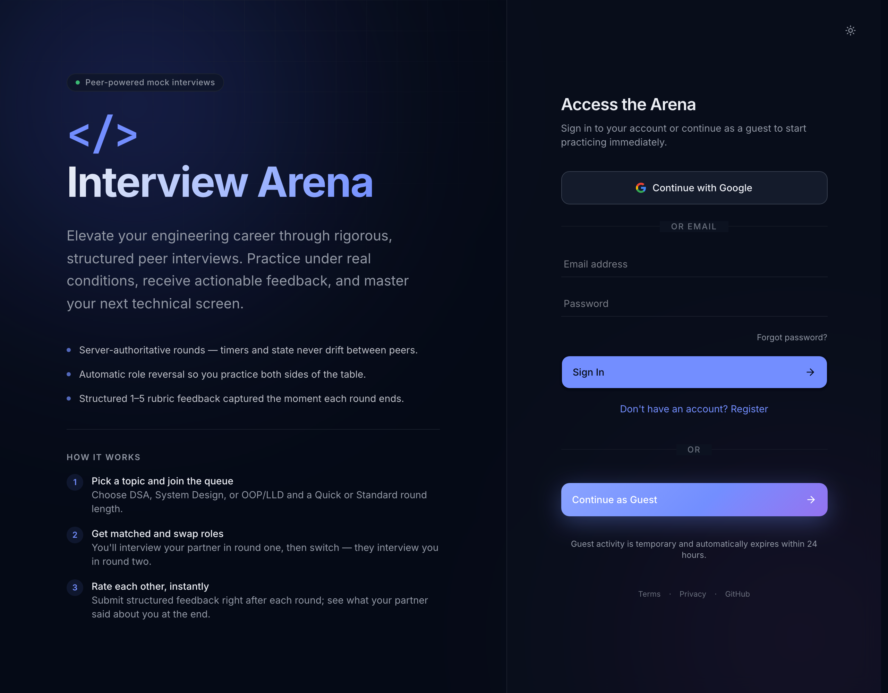
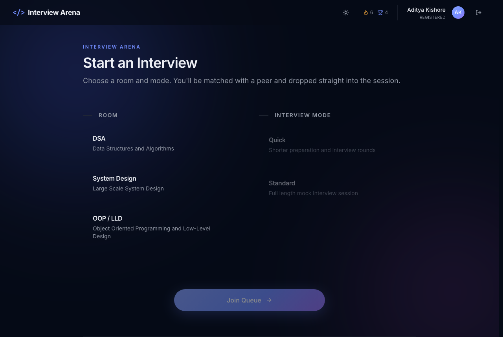
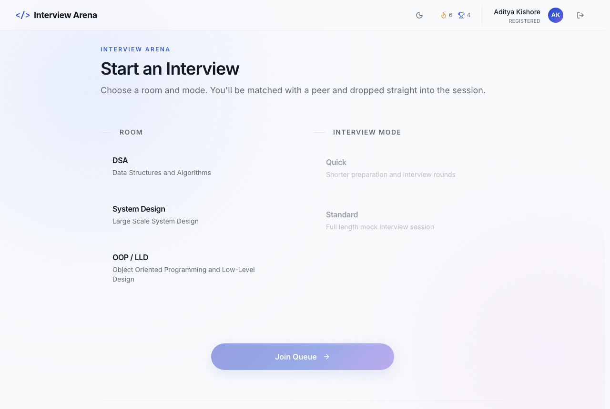
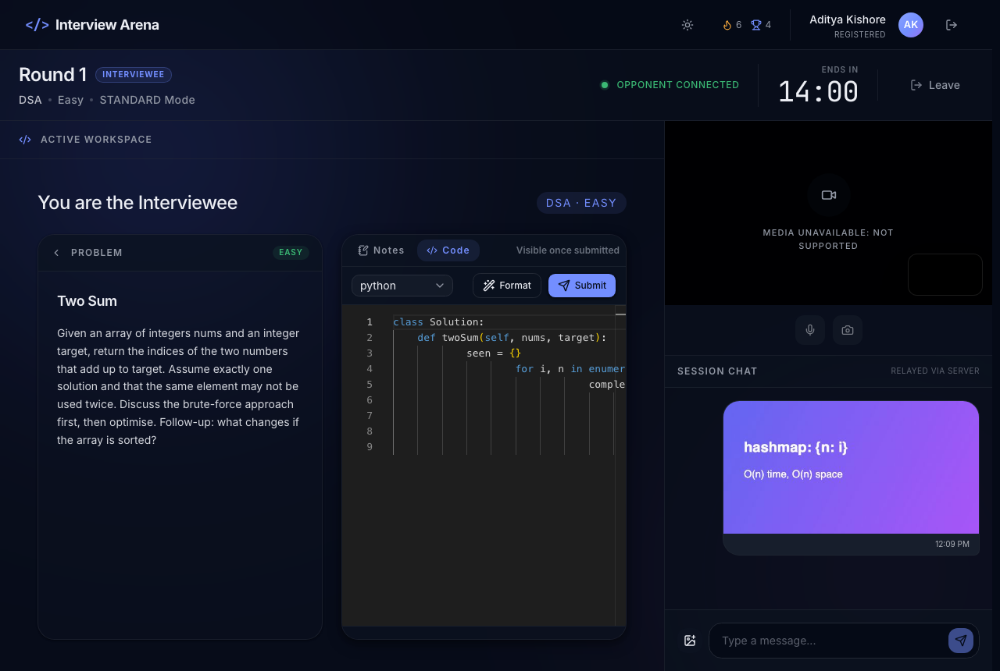
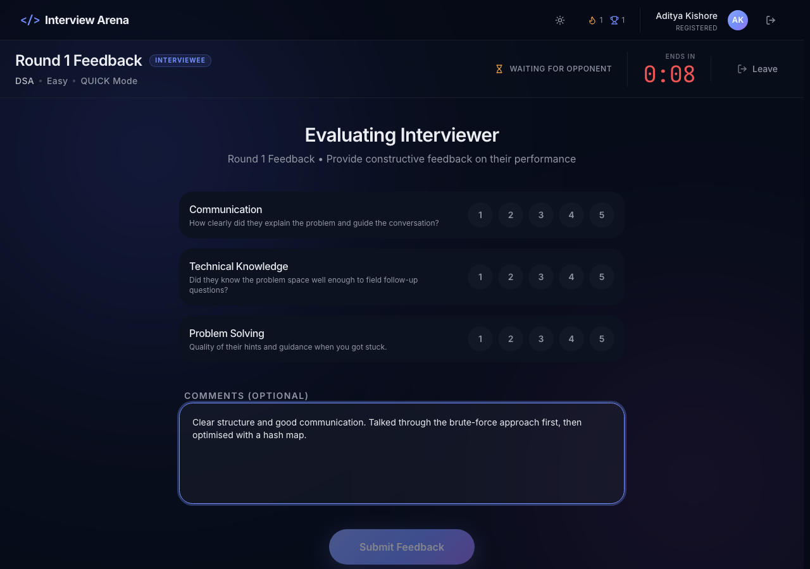
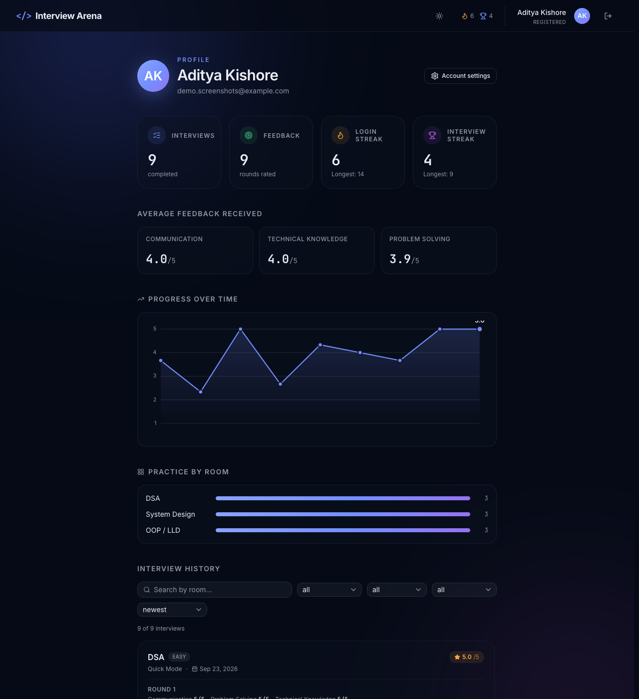
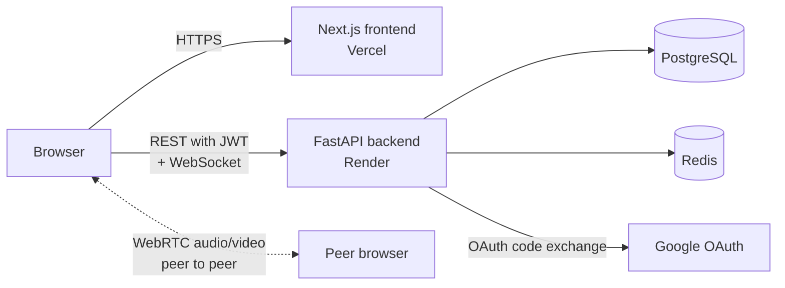

# Interview Arena

Interview Arena is a peer-to-peer mock interview platform. Two candidates are matched from a queue, interview each other over live video and chat (one plays interviewer while the other answers), swap roles for a second round, and rate each other on a 1–5 rubric. The interviewee can open an in-browser Monaco code editor and submit code for the interviewer to review, with real server-side formatting and either side able to share an ephemeral image in chat. Sign-in is by email and password, Google, or as a guest.

The interesting engineering is in the real-time path: matchmaking is an atomic Redis Lua script, the interview state machine and its timers are computed on the server (the browser only renders `endsAt` timestamps), session events fan out to both peers over WebSockets backed by Redis pub/sub, and audio/video is peer-to-peer WebRTC with the backend acting only as a signalling relay. Persistent data (users, sessions, rounds, feedback) lives in PostgreSQL behind SQLAlchemy async and Alembic migrations.

- **Live app:** https://interview-arena-gamma.vercel.app
- **API:** https://interview-arena-backend-m6zz.onrender.com (`/docs` serves the interactive OpenAPI page)

## Screenshots

Captured locally at 1280 px width with a made-up demo account and seeded history.

| | |
|---|---|
|  |  |
| Landing and sign-in (email/password, Google, guest) | Dashboard: pick a room and mode, streak badges, recent interviews |
|  |  |
| Dashboard in the light theme | Live round: problem panel, the optional Monaco code editor, chat with a shared image, server timer |

| | |
|---|---|
|  |  |
| Post-round feedback: three 1–5 ratings plus free-text comments | Profile: streaks, average ratings, a progress chart, and searchable/filterable interview history |

## Architecture



- The frontend is a Next.js App Router app. It talks to the API with Axios and to the session WebSocket at `/api/v1/sessions/{id}/ws`.
- The backend is a modular monolith: `identity`, `matchmaking`, `interview`, `realtime`, plus shared `core` (config, database, Redis, security).
- **PostgreSQL** holds users, profiles (including avatars), streaks, rooms, problems and their test cases, sessions, participants, rounds (including any submitted code), round roles and feedback.
- **Redis** holds matchmaking queues and locks, guest sessions, presence, WebSocket pub/sub channels and password-reset codes.
- Media never touches the backend. It only relays WebRTC signalling messages — shared images work the same way, relayed once over the same pub/sub channel and never written to PostgreSQL or Redis.

Local development is the same picture with everything on your machine: `docker compose` provides PostgreSQL 15 and Redis 7, the API runs on `:8000`, and the frontend on `:3000`.

## Features

- **Accounts:** email/password signup that creates the account and signs you in immediately (no email verification), login, Google OAuth, and ephemeral guest sessions. Enforced single active session per account — logging in elsewhere invalidates the previous token.
- **Account settings:** update display name, upload a profile photo with an interactive crop/reposition/zoom tool (`react-easy-crop`, cropped client-side to a small square before upload), change password, delete account (soft delete: the row is anonymised so interview history stays consistent).
- **Matchmaking:** join a queue per room (DSA, System Design, OOP/LLD) and mode (Quick or Standard). Pairing is reserved atomically in Redis so a user cannot end up in two matches.
- **Interview lifecycle:** preparation, round 1, feedback, round 2, feedback, complete. Roles reverse automatically for round 2. A session is marked abandoned if a participant disconnects and does not return.
- **Timers:** Quick uses 30 s preparation, 5 min rounds and 60 s feedback; Standard uses 30 s, 15 min and 120 s. The server decides every transition.
- **Problems:** each room has a seeded question bank (72 problems across three rooms, with genuine difficulty variety per slot). The interviewer can optionally search and pick a specific question from the bank or write their own instead of relying on the deterministic auto-pick.
- **Optional code editor (interviewee only):** a Monaco-based editor the interviewee can open when asked to code a solution — 9 languages, a language-aware theme that follows the site's light/dark toggle, and a Format button backed by real formatters (Prettier client-side for JavaScript/TypeScript; `black`, `clang-format` and `google-java-format` server-side for Python, C/C++ and Java). Submitting makes the code visible to the interviewer (read-only) and keeps it as part of interview history afterward. DSA problems carry sample test cases and a `/code/run` endpoint for running against them, but no execution provider is configured by default — see [Known demo limitations](#known-demo-limitations).
- **Ephemeral image sharing:** either participant can share an image in chat (e.g. a whiteboard sketch); it's relayed once over the same WebSocket pub/sub channel chat messages use and is never written to the database — it exists only for the life of the connection. Shared images and the local scratchpad both support click-to-maximize; the problem panel can be collapsed to give the code editor more room. Available identically to both participants regardless of role.
- **Live session UI:** presence indicator, server-driven countdown, a local notes scratchpad (not synchronised between peers), chat relayed through the server, and WebRTC audio/video with a retry path.
- **Feedback:** communication, technical knowledge and problem-solving ratings (1–5) plus optional comments, submitted idempotently per round.
- **Profile:** avatar, login/interview streaks, average ratings received, a progress-over-time chart, a room-practice breakdown, and the full interview history — searchable by room, filterable by mode and date range, sortable by rating — in a scrollable panel. The dashboard shows only the 6 most recent sessions with a link through to the full profile history.
- **History:** completed sessions with received feedback, for registered users. Guests do not get history.
- **Frontend polish:** dark and light themes, a site-wide hand cursor on interactive elements, terms and privacy pages.
- **Demo password recovery:** see the next section.

### Demo password recovery

Password recovery is deliberately a **demo mechanism**, not email-based recovery. No email is ever sent and no SMTP configuration exists.

1. `POST /api/v1/auth/password/forgot` stores a 6-digit code in Redis for 15 minutes and returns it in the response as `demo_code`.
2. The reset screen shows the code on screen, labelled as a demo, and pre-fills it.
3. `POST /api/v1/auth/password/reset` accepts the code once, enforces an 8-character minimum for the new password, hashes it with bcrypt, and deletes the code.

Limitations, stated plainly: anyone who knows a registered email address can obtain a code for it and set a new password (this includes Google-only accounts), and there is no rate limiting. An unregistered email receives an equally shaped but unusable code so the response does not reveal which emails exist.

## Tech stack

| Layer | Technologies (from `package.json` / `pyproject.toml`) |
|---|---|
| Frontend | Next.js 16 (App Router), React 19, TypeScript 5, Tailwind CSS 4, shadcn/ui on Base UI, TanStack Query 5, Zustand 5, Axios, lucide-react |
| Code editor | Monaco Editor (`@monaco-editor/react`), Prettier (client-side, JS/TS), `react-easy-crop` (avatar cropping) |
| Backend | Python 3.14, FastAPI, Uvicorn, Pydantic Settings, SQLAlchemy 2 (async) with asyncpg, Alembic, PyJWT (HS256), bcrypt, httpx |
| Code formatting/execution | `black` (Python), `clang-format` (C/C++, pip-bundled binary), `google-java-format` (Java, vendored jar run against a JDK downloaded once from Amazon Corretto and cached — see [Known demo limitations](#known-demo-limitations)); a third-party execution API (e.g. Judge0) can optionally be configured for running DSA solutions against test cases |
| Data | PostgreSQL, Redis (`redis.asyncio`, Lua scripting, pub/sub) |
| Real time | Native WebSockets, WebRTC (STUN by default, optional TURN) |
| Testing and tooling | pytest + pytest-asyncio, Playwright, ESLint 9, Ruff, mypy |

## API overview

Derived from the FastAPI routers. Interactive docs are at `/docs` on the running API. "JWT" means an `Authorization: Bearer <token>` header. The interview router is mounted under both `/api/v1/rooms` and `/api/v1/sessions` (the frontend uses `/sessions` for session routes and `/rooms` for the room list).

| Method | Endpoint | Purpose | Auth |
|---|---|---|---|
| POST | `/api/v1/auth/register` | Create an account and return a JWT | None |
| POST | `/api/v1/auth/login` | Email/password login | None |
| POST | `/api/v1/auth/guest` | Create an ephemeral guest session | None |
| GET | `/api/v1/auth/google/login` | Start Google OAuth | None |
| GET | `/api/v1/auth/google/callback` | Finish OAuth and redirect to the frontend with a token | None |
| POST | `/api/v1/auth/password/forgot` | Demo recovery: return a reset code | None |
| POST | `/api/v1/auth/password/reset` | Reset a password with the code | None |
| GET | `/api/v1/auth/me` | Current user | JWT |
| PATCH | `/api/v1/auth/me` | Update display name and/or avatar (a data URI or HTTPS URL; empty string removes it) | JWT (registered) |
| DELETE | `/api/v1/auth/me` | Soft-delete the account | JWT (registered) |
| POST | `/api/v1/auth/password/change` | Change or set a password | JWT (registered) |
| POST | `/api/v1/auth/logout` | Clear queue and match state, invalidate the session | JWT |
| GET | `/api/v1/auth/streaks/me` | Current login/interview streak counts | JWT (registered) |
| POST | `/api/v1/auth/streaks/checkin` | Mark today active for the login streak (idempotent) | JWT (registered) |
| GET | `/api/v1/sessions/` | List interview rooms | None |
| GET | `/api/v1/sessions/{session_id}` | Session state | JWT |
| POST | `/api/v1/sessions/{session_id}/leave` | Leave a session | JWT |
| GET | `/api/v1/sessions/{session_id}/rounds/{round_id}/problems/suggestions` | Question bank suggestions for this round's room/slot | JWT (round's interviewer) |
| POST | `/api/v1/sessions/{session_id}/rounds/{round_id}/problem` | Pick a question from the bank, or write a custom one | JWT (round's interviewer) |
| GET | `/api/v1/sessions/code/languages` | Languages the code editor's Run offers | JWT |
| POST | `/api/v1/sessions/{session_id}/rounds/{round_id}/code/run` | Run submitted code against a DSA problem's sample test cases | JWT (round's interviewee) |
| POST | `/api/v1/sessions/{session_id}/rounds/{round_id}/code/submit` | Submit code, making it visible to the interviewer | JWT (round's interviewee) |
| POST | `/api/v1/sessions/code/format` | Format code server-side (Python/C/C++/Java) | JWT |
| POST | `/api/v1/sessions/{session_id}/rounds/{round_id}/feedback` | Submit feedback | JWT |
| GET | `/api/v1/sessions/user/history` | Completed sessions with feedback and submitted code | JWT |
| POST | `/api/v1/matchmaking/join` | Join a queue (`QUICK` or `STANDARD`) | JWT |
| POST | `/api/v1/matchmaking/leave` | Leave the queue | JWT |
| GET | `/api/v1/matchmaking/status` | Queue or match status | JWT |
| WS | `/api/v1/sessions/{session_id}/ws?token=` | Events, chat, ephemeral image sharing and WebRTC signalling | JWT in query string |
| GET | `/health` | Liveness check (does no database or Redis I/O) | None |

Two test-only routes (`POST /api/v1/debug/flush-redis`, `DELETE /api/v1/debug/redis`) exist for the E2E suite and return 403 unless `TESTING=true`.

## Local development

### Prerequisites

- Python 3.14 and [uv](https://docs.astral.sh/uv/)
- Node.js 20 or newer
- Docker (for PostgreSQL and Redis)

### 1. Start PostgreSQL and Redis

```bash
docker compose up -d
```

The defaults in `backend/app/core/config.py` match `docker-compose.yml`, so no `.env` file is needed for local development.

### 2. Backend

```bash
cd backend
uv sync
uv run alembic upgrade head
uv run uvicorn app.main:app --reload        # http://localhost:8000
```

### 3. Frontend

```bash
cd frontend
npm install
npm run dev                                 # http://localhost:3000
```

The frontend calls `http://localhost:8000` unless `NEXT_PUBLIC_API_URL` is set (for example in `frontend/.env.local`).

To enable the code editor's Run button locally, add `CODE_EXECUTION_API_KEY` (and, if needed, `CODE_EXECUTION_API_URL`) to `backend/.env` — everything else in the code editor works without it. No `.env` file is needed otherwise.

## Testing

```bash
# Backend: 115 tests across 28 files (needs PostgreSQL and Redis)
cd backend && TESTING=true uv run pytest

# Frontend
cd frontend
npx tsc --noEmit        # type check (there is no npm script for it)
npm run lint
npm run build
```

Backend tests cover authentication and registration, single-session enforcement, password recovery, Google OAuth (mock and real code paths), guest sessions, matchmaking and the Lua reservation, the interview lifecycle, abandonment, feedback idempotency, realtime behaviour, streaks, avatar uploads, problem selection (registered and guest), the code editor's run/submit endpoints, and server-side code formatting. Tests that need a real JDK for Java formatting mock that specific call (see `code_formatting.py`'s comment) rather than hit a real ~200 MB download in CI; `black` and `clang-format` run for real since they need no external download.

> **Warning:** the pytest fixtures flush Redis before and after every test. Point `REDIS_URL` at a throwaway Redis, never one that holds data you care about.

**End-to-end (Playwright).** Five specs in `frontend/e2e` drive real browsers, including two-user matchmaking, chat and WebRTC. They are local-only: the config and specs assume the frontend on `localhost:3000` and the API on `localhost:8000` with `TESTING=true` (which shortens interview timers to seconds and mocks Google OAuth).

```bash
cd backend && TESTING=true uv run uvicorn app.main:app
cd frontend && npm run build && npm run start
cd frontend && npx playwright test
```

## CI/CD

There is no GitHub Actions workflow in this repository, so tests, lint and builds are not run automatically. Vercel builds and deploys the frontend when commits land on `main` (visible as deployment records on the GitHub repository). The repository contains no Render or Vercel configuration files, so the backend's Render build and start settings are managed outside this repo.

## Environment variables

Names and purposes only.

**Backend**

| Variable | Purpose |
|---|---|
| `DATABASE_URL` | PostgreSQL connection for the application. `postgres://` and `postgresql://` URLs are normalised to the asyncpg driver and `sslmode` is translated. |
| `DIRECT_URL` | Optional. A direct (non-pooled) PostgreSQL connection used by Alembic; falls back to `DATABASE_URL`. |
| `REDIS_URL` | Redis connection (`redis://` or `rediss://`). |
| `SECRET_KEY` | JWT signing key. The default in code is a development placeholder and must be overridden in production. |
| `ALGORITHM` | JWT algorithm. Defaults to `HS256`. |
| `ACCESS_TOKEN_EXPIRE_MINUTES` | JWT lifetime. Defaults to 7 days. |
| `GOOGLE_CLIENT_ID`, `GOOGLE_CLIENT_SECRET` | Google OAuth client credentials. |
| `BACKEND_URL` | Public URL of this API. Used to build the Google OAuth `redirect_uri` (`{BACKEND_URL}/api/v1/auth/google/callback`), which must match the Google client configuration. |
| `FRONTEND_URL` | Public URL of the frontend. The OAuth callback redirects here with the token. |
| `TESTING` | Test-only. Shortens timers, mocks Google OAuth and enables the debug routes. Never set in production. |
| `CODE_EXECUTION_API_URL` | Base URL of a third-party sandboxed code execution API (e.g. Judge0). Only used by `/code/run`; without a working provider configured, Run fails with a clear error but nothing else in the code editor is affected. |
| `CODE_EXECUTION_API_KEY` | API key for the execution provider above, if it requires one. |

**Frontend**

| Variable | Purpose |
|---|---|
| `NEXT_PUBLIC_API_URL` | API base URL (also used to derive the WebSocket URL). Baked in at build time. |
| `NEXT_PUBLIC_TURN_URL`, `NEXT_PUBLIC_TURN_USERNAME`, `NEXT_PUBLIC_TURN_CREDENTIAL` | Optional TURN relay for WebRTC. Without it, connections use STUN only. |

## Deployment

- **Frontend:** Next.js on Vercel at https://interview-arena-gamma.vercel.app, deployed from `main`.
- **Backend:** FastAPI on Render at https://interview-arena-backend-m6zz.onrender.com, backed by PostgreSQL and Redis.
- Production needs `DATABASE_URL`, `REDIS_URL`, `SECRET_KEY`, `FRONTEND_URL` and `BACKEND_URL`, plus the Google credentials for Google sign-in. `TESTING` must be unset.
- `GET /health` returns 200 without touching the database or Redis, so it shows the process is up, not that its dependencies are reachable. If auth fails with a 500, check that `DATABASE_URL` and `REDIS_URL` are set: the code silently falls back to `localhost` defaults otherwise.
- Google Cloud must list `{BACKEND_URL}/api/v1/auth/google/callback` as an authorised redirect URI.
- Java code formatting needs outbound access to `corretto.aws` (downloads a JDK once, then caches it — see [Known demo limitations](#known-demo-limitations)); on a host with ephemeral disk, that download repeats on every fresh deploy.

`interview-arena-docs/` contains the original design documents (requirements, HLD/LLD, database, API, realtime, security, testing, deployment, ADRs). They are design-phase documents; where they differ from the code (for example the OpenAPI sketch), the code is the source of truth.

## Database and migrations

Schema changes are managed with Alembic (`backend/alembic/versions`), a single linear chain ending at `b2c3d4e5f6a7`. Run migrations from `backend/`:

```bash
uv run alembic upgrade head
```

| Revision | Purpose |
|---|---|
| `524ab1dd6a84` | Initial schema |
| `0002` | Seeds the three interview rooms (DSA, System Design, OOP/LLD) |
| `7e93940e4498`, `89581413d982` | Session `mode` (Quick/Standard) and a session `version` counter |
| `489d85220153` | Rounds, round participants and feedback tables |
| `a8e9876e9f00` | Adds `auth_provider` and `is_verified` to users |
| `b1f2c3d4e5a6` | Adds room difficulty and the seeded question bank |
| `c2a1e6f0b3d7` | `user_streaks` table (login and interview streaks) |
| `d4f8b21a9c6e` | Adds `problem_id`/`custom_problem_text` to rounds (interviewer's question pick) |
| `e7c4a1f9d2b8` | Adds `users.session_version` (single active session enforcement) |
| `f1a2b3c4d5e6` | Expands the problem bank from 12 to 48 problems |
| `a3b7c9d1e2f4` | Adds `profiles.avatar_url` |
| `b4c8d2e6f1a3` | Adds 24 more problems, chosen to give every room/slot real difficulty variety (bank is now 72) |
| `a1b2c3d4e5f6` | Adds `submitted_code`/`submitted_language`/`code_submitted_at` to rounds |
| `b2c3d4e5f6a7` | Adds `problem_test_cases` and `interview_problems.io_note`, and seeds sample test cases for the DSA problems |

Notes:

- The current code expects the schema at `b2c3d4e5f6a7`. Run `alembic upgrade head` before deploying code that depends on a newer revision.
- `a8e9876e9f00` added `is_verified` defaulting to false and did not backfill existing rows. The application no longer checks `is_verified` at login, so those users are not locked out. The column is kept to avoid a schema change.
- Whether production has been migrated to `b2c3d4e5f6a7` cannot be determined from this repository. Check with `alembic current` against the production database.
- The Render service configuration is not in this repository, so it is not documented here whether migrations run automatically on deploy.

## Known demo limitations

- **Password recovery is a demo** (see above): the reset code is returned to whoever asks, so anyone who knows an email can reset that account's password. There is no rate limiting on auth endpoints.
- **No email is sent and email is never verified.** Signup does not confirm ownership of the address.
- **Tokens:** JWTs last 7 days and are stored in `localStorage`. Logging in elsewhere or logging out bumps a per-user `session_version`, so old tokens stop being accepted — but nothing revokes a token that was never invalidated this way (e.g. it's still valid until it naturally expires if the account is never logged into elsewhere). The WebSocket takes the token as a query parameter.
- **CORS** allows all origins with credentials enabled.
- **Google sign-in** matches an existing account by email and does not check Google's `verified_email` flag.
- **Route protection is client-side:** pages redirect unauthenticated users; there is no server-side middleware.
- **Guests** are ephemeral (Redis, 24 h) and get no saved history.
- **The Notes tab is local** to each browser; unlike the Code tab (which the interviewee can explicitly submit for the interviewer to see), notes are never synchronised or sent anywhere.
- **Code execution ("Run") is switched off in the UI by default** — the `RUN_ENABLED` flag in `frontend/src/components/interview/CodeEditor.tsx` hides the button until you've configured a working execution provider via `CODE_EXECUTION_API_URL`/`CODE_EXECUTION_API_KEY` (e.g. a Judge0-compatible API) and flipped that flag to `true`. The backend endpoint and its tests are fully built either way; everything else in the code editor (writing, formatting, submitting) works without it.
- **Java formatting downloads a JDK on first use** (from Amazon Corretto, then caches it) if one isn't already cached — a one-time ~30s delay per fresh environment. The backend pre-warms this in the background at startup outside of `TESTING` mode so real users shouldn't hit it directly.
- **Shared images are intentionally not persisted anywhere** — they're relayed once over the WebSocket and exist only in the browser's memory for that session. This is by design (see Features), not a missing feature.
- **Video** relies on STUN unless TURN is configured, so it may fail on restrictive networks. The call is started manually with "Connect Audio/Video".
- **Content set:** three rooms with a 72-problem seeded question bank (24 per room, with real difficulty variety per slot); sample test cases for Run only exist for the DSA room's problems.
- **No CI**, and the E2E suite is tied to fixed local ports.
