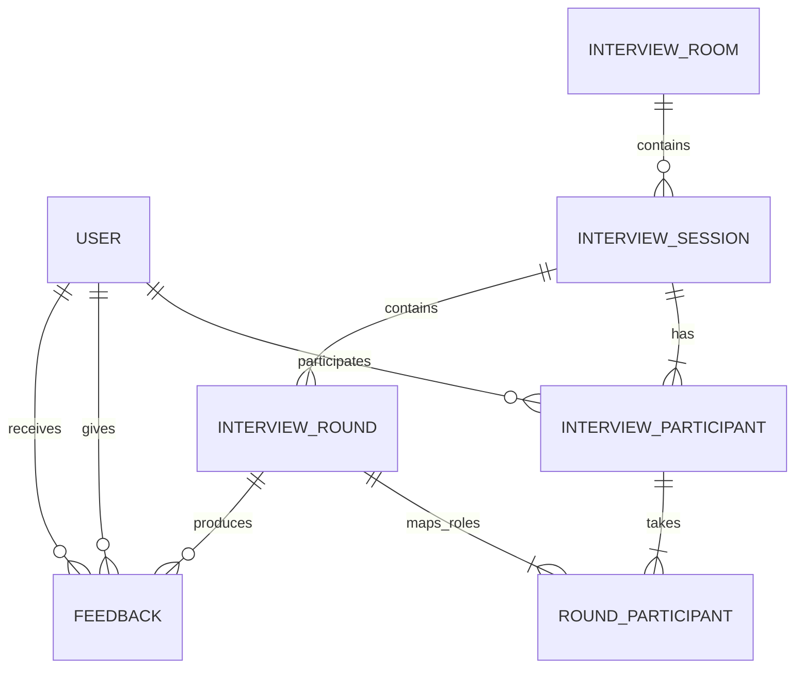
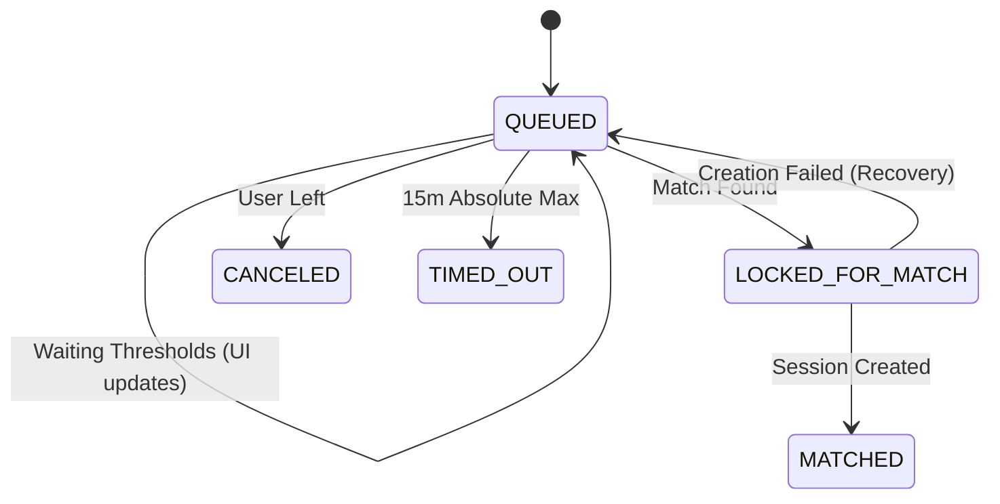
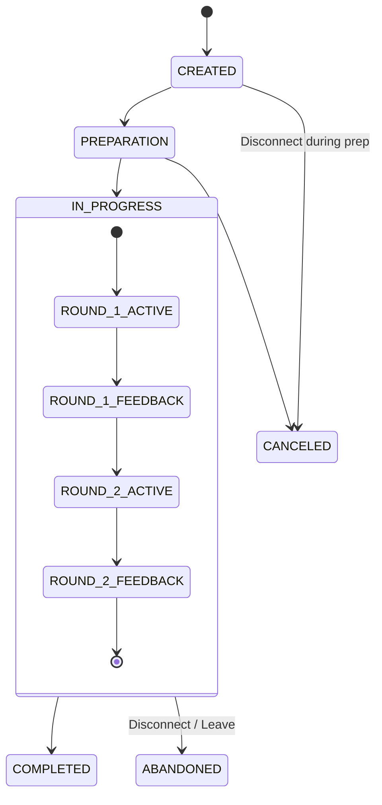

# Domain Model

## Core Concepts

### Persistent

- `User`
- `Profile`
- `InterviewRoom`
- `InterviewSession`
- `InterviewParticipant`
- `InterviewRound`
- `RoundParticipant`
- `Feedback`

### Temporary

- `GuestSession`
- `QueueEntry`
- Active presence
- Active WebSocket connection state

### Derived / Cached

- Candidate rating
- Interviewer rating
- Interaction history / recent pairing signals

## Relationships



## Interview Modes

Sessions operate under configurable durations dynamically applied via an `InterviewMode`.

- `QUICK`: ~13 minutes total. 1 min prep, 5 min rounds, 1 min feedback.
- `STANDARD`: ~35 minutes total. 1 min prep, 15 min rounds, 2 min feedback.

## Interview Roles

Roles are round-specific and durably mapped in `round_participants`:

- `INTERVIEWER`
- `INTERVIEWEE`

Round 1:

```text
A → INTERVIEWER
B → INTERVIEWEE
```

Round 2 (Strict Reversal):

```text
A → INTERVIEWEE
B → INTERVIEWER
```

## Matchmaking State Machine

Managed ephemerally via Redis.



## Interview Session State Machine

Managed transactionally in PostgreSQL. Interrupted sessions transition to `ABANDONED`.



## Domain Rules

1. Guest users match only with guests.
2. Registered users match only with registered users.
3. Users cannot select a specific opponent.
4. Matchmaking is random among eligible users within the same room and Interview Mode.
5. Users cannot match with their immediate last partner.
6. The backend owns session state and authoritative timers.
7. Interrupted rounds/sessions are marked `ABANDONED`, never `COMPLETED`.
8. Feedback is recorded per round. A feedback timeout automatically progresses the state machine.
9. Feedback results are revealed only after the complete session.
10. Guest results are temporary and erased when the guest session ends.
