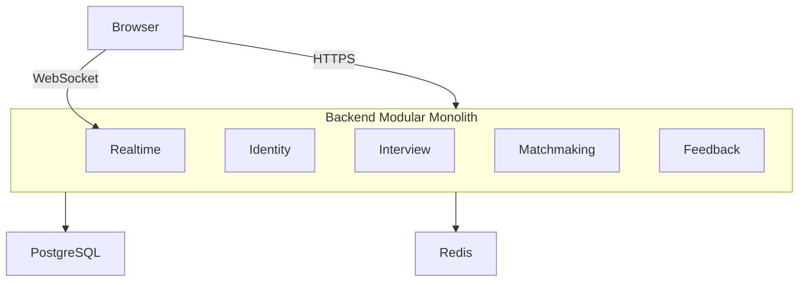
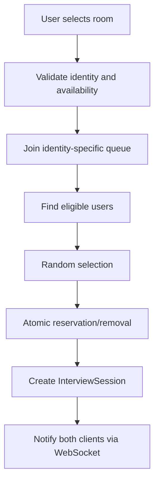
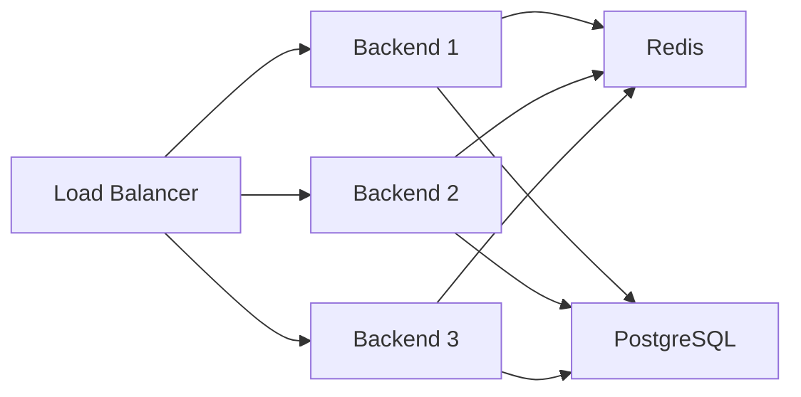

# High-Level Design

## Initial Architecture

Interview Arena starts as a **modular monolith**.



## Backend Modules

### Identity

Responsible for:

- registered users
- authentication
- authorization
- guest sessions

### Interview

Responsible for:

- interview rooms
- sessions
- participants
- rounds
- session lifecycle

### Matchmaking

Responsible for:

- queues
- eligibility
- random matching
- anti-repeat pairing rules

### Feedback / Rating

Responsible for:

- per-round feedback
- rating aggregation
- reputation

### Real-Time

Responsible for:

- WebSockets
- presence
- live session events
- reconnect coordination

## PostgreSQL

Persistent business data:

- users
- profiles
- interview rooms
- sessions
- participants
- rounds
- feedback

## Redis

Ephemeral/high-speed state:

- active queues
- presence
- active connection mapping
- temporary guest state
- coordination/locks where required

## Matchmaking



Queues are separated:

- Guest queue → guests only
- Registered queue → registered users only

## Concurrency

The matchmaking operation must atomically:

1. identify an eligible pair
2. reserve both
3. remove both from the waiting queue
4. create/initialize the session

Redis atomic operations/server-side scripting are the initial coordination mechanism.

## Timer

The server stores authoritative round timestamps.

The browser displays remaining time but cannot decide when a round ends.

## Feedback

At the end of each round:

```text
ROUND → FEEDBACK → both submit / bounded timeout → next state
```

Feedback is stored immediately but hidden until the full session completes.

## Disconnect / Reconnect

```text
ACTIVE
  ↓
DISCONNECTED / RECONNECTING
  ↓
ACTIVE
```

or:

```text
RECONNECTING
  ↓
ABANDONED
```

## Architecture Evolution

### Stage A

```text
Browser → Backend → PostgreSQL + Redis
```

### Stage B

```text
Internet → Backend → PostgreSQL + Redis
```

### Stage C



Only later, based on measured need, may components such as Matchmaking, Real-Time, AI, Assessment, or Analytics become separately scalable services.
