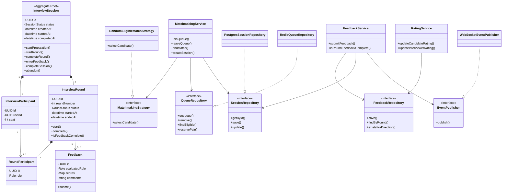
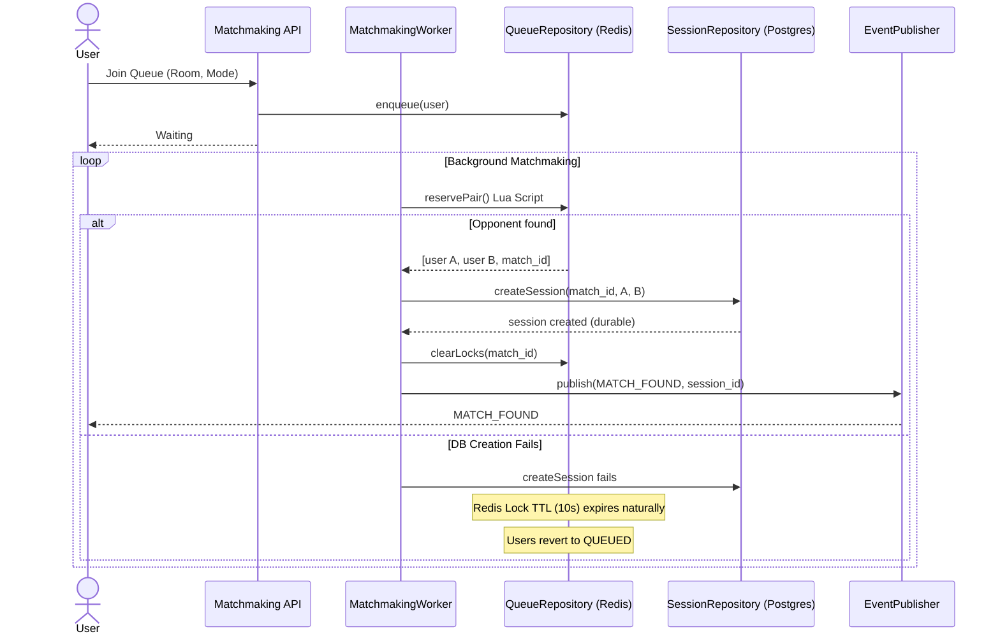
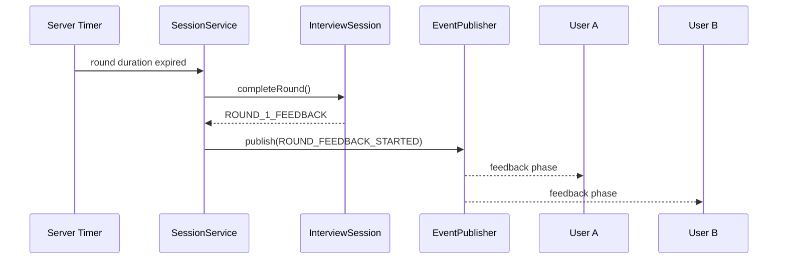
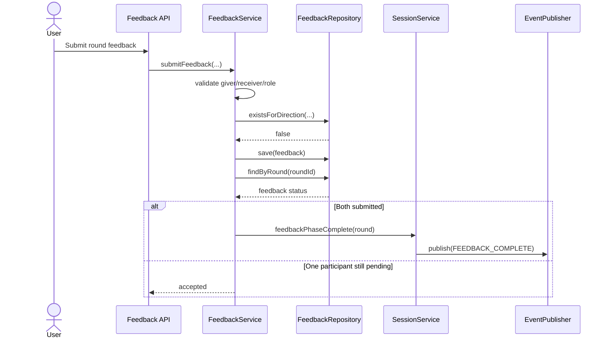

# Low-Level Design (LLD)

**Status:** Proposed — Phase 0.9

## 1. Purpose

LLD translates the domain model and HLD into implementation-level software design.

It answers:
- What classes/modules exist?
- What responsibility does each have?
- Who owns business invariants?
- Which dependencies are interfaces?
- How do objects collaborate?
- Which design patterns are justified?

LLD is not a copy of the ERD. Database tables describe persistence; classes describe software behavior.

## 2. SOLID Principles

### Single Responsibility Principle

Separate coherent responsibilities:

```text
MatchmakingService → matchmaking decisions
SessionService     → interview lifecycle
FeedbackService    → feedback workflow
RatingService      → reputation calculation
```

Avoid one giant InterviewService.

### Open/Closed Principle

New matchmaking or rating policies should be addable without rewriting unrelated application logic.

### Liskov Substitution Principle

Implementations of an abstraction must remain valid substitutes.

Example:

```text
QueueRepository
    ├── RedisQueueRepository
    └── InMemoryQueueRepository
```

### Interface Segregation Principle

Prefer focused interfaces over large infrastructure interfaces.

### Dependency Inversion Principle

Application/domain services depend on abstractions rather than directly constructing PostgreSQL or Redis clients.

```text
MatchmakingService
       ↓
QueueRepository
       ↓
RedisQueueRepository
```

## 3. Module Boundaries

```text
Presentation
    ↓
Application
    ├── Identity
    ├── Matchmaking
    ├── Interview Session
    ├── Feedback
    └── Rating
    ↓
Domain
    ├── InterviewSession
    ├── InterviewRound
    ├── Participant
    └── Domain Rules
    ↓
Ports / Interfaces
    ├── SessionRepository
    ├── UserRepository
    ├── FeedbackRepository
    ├── QueueRepository
    ├── PresenceRepository
    └── EventPublisher
    ↓
Infrastructure
    ├── PostgreSQL
    ├── Redis
    └── WebSocket infrastructure
```

Dependency direction:

```text
Presentation → Application → Domain
                           ↑
                    Infrastructure
                    implements Ports
```

## 4. Core Classes

### InterviewSession

Aggregate root for the reciprocal interview.

Responsibilities:
- maintain valid lifecycle state
- start preparation
- start/complete rounds
- enter feedback
- complete session
- abandon session

Conceptual operations:

```text
startPreparation()
startRound()
completeRound()
enterFeedback()
completeSession()
abandon()
```

### InterviewRound

Represents Round 1 or Round 2.

Responsibilities:
- round state
- timing
- role assignments
- feedback completion

### InterviewParticipant

Represents a user's membership in a session. Role is not permanent; role belongs to the round.

### MatchmakingService

Responsibilities:
- validate queue entry
- find eligible opponent
- reserve the pair
- create/initiate a session

It should not own Redis commands, PostgreSQL details, or WebSocket implementation.

### FeedbackService

Responsibilities:
- validate feedback
- enforce one submission per direction
- persist feedback
- determine whether the feedback phase is complete

### RatingService

Responsibilities:
- calculate/update candidate and interviewer reputation
- apply completion policy

## 5. Ports / Interfaces

### SessionRepository

```text
getById(sessionId)
save(session)
update(session)
```

### QueueRepository

```text
enqueue(entry)
remove(entry)
findEligible(...)
reservePair(...)
```

### FeedbackRepository

```text
save(feedback)
findByRound(roundId)
existsForDirection(roundId, giver, receiver)
```

### EventPublisher

```text
publish(event)
```

## 6. Design Patterns

Patterns are used only when they solve a demonstrated design problem.

### Repository — Use

Abstract persistence from application/domain logic.

```text
SessionRepository
      ↑
PostgresSessionRepository
```

```text
QueueRepository
      ↑
RedisQueueRepository
```

### Strategy — Use

Allows matchmaking policy to evolve.

```text
MatchmakingStrategy
    └── RandomEligibleMatchStrategy
```

Future strategies could include rating-band or learning-oriented matching.

### Adapter — Use

Hide infrastructure/library-specific APIs behind application-facing interfaces.

```text
Redis client
    ↓
RedisQueueRepository
    ↓
QueueRepository
```

### State — Potentially Use

The interview session has meaningful lifecycle states:

```text
CREATED
MATCHED
PREPARATION
ROUND_1
ROUND_1_FEEDBACK
ROLE_SWAP
ROUND_2
ROUND_2_FEEDBACK
COMPLETED
ABANDONED
```

For MVP, an enum plus centralized transition logic is sufficient. If state-specific behavior grows, a formal State pattern can be introduced.

### Factory — Do Not Use Yet

Creation is currently simple. Constructors/factory functions are sufficient.

### Singleton — Avoid

Use dependency injection and application lifecycle management instead.

## 7. UML Class Diagram



## 8. Sequence Diagram — Join Queue and Match (Two-Phase Idempotent)



## 9. Sequence Diagram — Round Completion



## 10. Sequence Diagram — Feedback Submission



## 11. Dependency Injection

Constructor injection is preferred.

```python
class MatchmakingService:
    def __init__(
        self,
        queue_repository: QueueRepository,
        session_repository: SessionRepository,
        matchmaking_strategy: MatchmakingStrategy,
        event_publisher: EventPublisher,
    ):
        ...
```

This allows:

```text
Production:
MatchmakingService → RedisQueueRepository

Unit test:
MatchmakingService → InMemoryQueueRepository
```

The same service can therefore be tested without starting Redis.

## 12. Pattern and SOLID Verification

Before implementation:

- SRP: each service has a coherent reason to change
- OCP: new matching strategies can be added without rewriting the service
- LSP: fake repositories can substitute for production implementations
- ISP: interfaces stay small and focused
- DIP: application services depend on interfaces, not infrastructure clients

## 13. Patterns Deliberately Not Used

Avoid pattern-heavy code for its own sake:

- Singleton
- Abstract Factory
- Builder everywhere
- Command everywhere
- Observer everywhere
- Decorator everywhere

A design pattern should solve a specific problem, not serve as a resume keyword.

## 14. Phase 0.9 Deliverables

- UML class diagram
- sequence diagrams
- session state model
- module/class responsibilities
- interface definitions
- dependency direction
- design-pattern decisions
- SOLID rationale
- dependency injection strategy
- test seams

The next phase is API Design.
