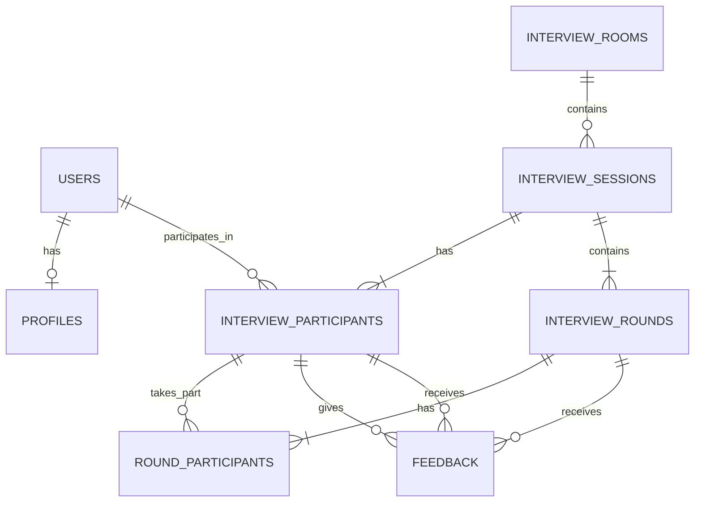

# Database Design

**Status:** Proposed — Phase 0.8

## 1. Design Goal

Design the persistent data model from the domain model and HLD.

The key rule is:

> Store durable business facts in PostgreSQL. Keep short-lived coordination state in Redis. Do not store derived values when the source data is sufficient.

The first version targets roughly 100 concurrent users and should optimize for correctness and understandable design rather than premature scaling.

---

## 2. Persistence Boundary

### PostgreSQL

Persistent registered-user data:

- Users
- Profiles
- Interview rooms
- Completed/persisted interview sessions
- Session participants
- Interview rounds
- Feedback
- Persistent rating evidence / aggregates if needed

### Redis

Temporary/high-speed state:

- Guest sessions
- Guest temporary dashboards
- Guest queues
- Registered-user matchmaking queues
- Presence
- Active WebSocket connection mappings
- Short-lived locks / matchmaking coordination
- Other temporary session coordination state

### Important decision

There is **no persistent GuestUser table** in the initial design.

A guest receives a temporary identity represented by a GuestSession in Redis. Guest-to-guest interviews and their temporary results remain in ephemeral state and expire/delete when the guest session ends.

Registered users are persisted in PostgreSQL.

---

## 3. Main Relational Entities

```text
users
profiles
interview_rooms
interview_sessions
interview_participants
interview_rounds
round_participants
feedback
```

A possible future derived/cache structure:

```text
user_reputation
```

but the source of truth for reputation is feedback.

---

## 4. Entity Responsibilities

### `users`

Represents the persistent identity of a registered user.

Core attributes:

```text
id
email
password_hash
status
created_at
updated_at
```

Rules:

- `id` is the primary key.
- `email` is unique.
- Passwords are never stored in plaintext.
- Account status should support disabling/deactivation.

### `profiles`

Optional basic registered-user information.

For the MVP keep this intentionally small:

```text
user_id
display_name
created_at
updated_at
```

Do not build a large candidate profile yet.

### `interview_rooms`

Represents a persistent interview category.

Initial rows:

```text
DSA
System Design
OOP / LLD
```

Suggested attributes:

```text
id
slug
name
description
is_active
created_at
updated_at
```

Use rows rather than hard-coded application enums so future rooms can be added without changing code.

### `interview_sessions`

Represents one complete reciprocal interview.

Suggested attributes:

```text
id
room_id
status
created_at
started_at
completed_at
abandoned_at
```

The session is the durable business object for registered-user interviews.

### `interview_participants`

Represents a user's participation in one interview session.

Suggested attributes:

```text
id
session_id
user_id
seat
joined_at
left_at
```

`seat` is either `1` or `2`.

Important constraints:

```text
UNIQUE(session_id, user_id)
UNIQUE(session_id, seat)
```

This prevents the same user from appearing twice and limits the session to two participant positions.

### `interview_rounds`

Represents Round 1 or Round 2 inside a session.

Suggested attributes:

```text
id
session_id
round_number
status
started_at
ended_at
created_at
```

Constraints:

```text
UNIQUE(session_id, round_number)
CHECK(round_number IN (1, 2))
```

### `round_participants`

Represents the role a participant has during one specific round.

Suggested attributes:

```text
id
round_id
participant_id
role
```

Role values:

```text
INTERVIEWER
INTERVIEWEE
```

Constraints:

```text
UNIQUE(round_id, participant_id)
```

The application/database transaction must ensure:

- exactly two round participants
- exactly one interviewer
- exactly one interviewee

This models role switching cleanly.

### `feedback`

Represents one user's evaluation of the other participant for one round.

Suggested attributes:

```text
id
round_id
giver_participant_id
receiver_participant_id
evaluated_role
status

scores
comments
submitted_at
```

Constraints:

```text
UNIQUE(round_id, giver_participant_id, receiver_participant_id)
CHECK(giver_participant_id <> receiver_participant_id)
```

`evaluated_role` is either:
status


```text
INTERVIEWER
INTERVIEWEE
```

The exact feedback rubric is intentionally flexible.

---

## 5. Feedback Score Representation

For the MVP, use a PostgreSQL `JSONB` field for structured scores rather than creating one database column for every possible criterion.

Example:

```json
{
  "problem_solving": 8,
  "technical_knowledge": 7,
  "communication": 9,
  "approach": 8,
  "overall": 8
}
```

Interviewer evaluation may use:

```json
{
  "question_quality": 8,
  "follow_up_quality": 7,
  "communication": 9,
  "fairness": 10,
  "overall": 8
}
```

Why JSONB initially?

- The feedback rubric will evolve.
- Different interview rooms may eventually have different criteria.
- It avoids creating a rigid schema for a questionnaire-like structure.
- PostgreSQL still stores and validates the outer feedback record relationally.

The application layer must validate allowed fields, score ranges, and role-specific rubrics.

If later analytics require frequent SQL aggregation across individual criteria, the scoring model can be normalized into dedicated `feedback_criteria` / `feedback_scores` tables.

---

## 6. Registered vs Guest Data Model

### Registered

```text
PostgreSQL
    ↓
User
    ↓
InterviewSession
    ↓
Rounds
    ↓
Feedback
    ↓
Persistent reputation
```

### Guest

```text
Redis
    ↓
GuestSession
    ↓
Temporary dashboard
    ↓
Guest interview state
    ↓
Temporary feedback/results
```

There is no guest reputation persisted after the guest session ends.

---


## 7. Proposed ER Diagram



---

## 8. Cardinality

### User → Profile

```text
1 : 0..1
```

A registered user may have zero or one profile.

### User → InterviewParticipant

```text
1 : many
```

A registered user can participate in many interviews.

### InterviewSession → Participants

```text
1 : exactly 2
```

The product requires exactly two participants.

### InterviewSession → Rounds

```text
1 : exactly 2
```

The initial session has two rounds.

### Round → RoundParticipants

```text
1 : exactly 2
```

Each round has one interviewer and one interviewee.

### Round → Feedback

```text
1 : up to 2
```

One feedback record from each participant for the round.

---

## 9. Candidate Schema

A simplified relational schema is:

```text
users
-----
id PK
email UNIQUE
password_hash
status
created_at
updated_at

profiles
--------
user_id PK/FK -> users.id
display_name
created_at
updated_at

interview_rooms
---------------
id PK
slug UNIQUE
name
description
is_active
created_at
updated_at

interview_sessions
------------------
id PK
room_id FK -> interview_rooms.id
mode

status
created_at
started_at
completed_at
abandoned_at

interview_participants
----------------------
id PK
session_id FK -> interview_sessions.id
user_id FK -> users.id
seat
joined_at
left_at

interview_rounds
----------------
id PK
session_id FK -> interview_sessions.id
round_number
status
started_at
ended_at
created_at

round_participants
------------------
id PK
round_id FK -> interview_rounds.id
participant_id FK -> interview_participants.id
role

feedback
--------
id PK
round_id FK -> interview_rounds.id
giver_participant_id FK -> interview_participants.id
receiver_participant_id FK -> interview_participants.id
evaluated_role
status

scores JSONB
comments
submitted_at
```

---

## 10. Why We Do Not Put User A / User B Directly in the Session

Avoid:

```text
interview_sessions
------------------
user_a_id
user_b_id
user_a_role
user_b_role
```

because roles change between rounds.

Instead:

```text
Session
  ↓
Participants
  ↓
Round
  ↓
Round Participants
  ↓
Role
```

This directly represents the business model and avoids special-case columns.

---

## 11. Why Ratings Are Not the Source-of-Truth Table

Do not make:

```text
users
-----
candidate_rating
interviewer_rating
```

the primary source of reputation.

The primary evidence is:

```text
feedback
```

From feedback we can derive:

```text
candidate average
interviewer average
rating count
history
```

A future cached/aggregate table may improve performance:

```text
user_reputation
---------------
user_id PK
candidate_rating
candidate_rating_count
interviewer_rating
interviewer_rating_count
updated_at
```

But this is derived data.

If the aggregate becomes incorrect, it should be possible to rebuild it from feedback.

---

## 12. Rating Update Rule

Because feedback is submitted after each round but the session consists of two reciprocal rounds:

> Store round-level feedback immediately; update persistent reputation only when the complete registered-user session reaches `COMPLETED`.

This avoids giving a partially completed or abandoned session a normal final reputation update.

The exact abandonment/rating policy is a product rule that can be refined after testing.

---

## 13. Interaction History

We do not need a dedicated interaction-history table in the MVP.

A recent pairing can initially be derived from:

```text
interview_sessions
→ interview_participants
```

with appropriate indexes.

Example question:

> Have registered users A and B interviewed each other recently?

The backend queries completed/recent sessions involving both users.

If this becomes too expensive as the user base grows, we can introduce a derived pair-history structure:

```text
user_pair_history
-----------------
user_low_id
user_high_id
last_session_at
session_count
```

This should be treated as derived data, not the canonical record of interviews.

---

## 14. Guest Data Lifecycle

Guest state should be automatically disposable.

Conceptually:

```text
GuestSession created
        ↓
Redis key(s) created with TTL
        ↓
Guest joins queue
        ↓
Guest participates in sessions
        ↓
Temporary dashboard accumulates results
        ↓
Guest leaves / session expires
        ↓
Redis keys expire / are explicitly deleted
```

This avoids retaining anonymous users indefinitely.

A guest should not have a persistent relational identity simply to support the temporary dashboard.

---

## 15. Important Constraints

### User identity

```text
users.email UNIQUE
```

### Session participants

```text
UNIQUE(session_id, user_id)
UNIQUE(session_id, seat)
```

### Round numbering

```text
UNIQUE(session_id, round_number)
CHECK(round_number BETWEEN 1 AND 2)
```

### Round participation

```text
UNIQUE(round_id, participant_id)
```

### Feedback duplication

```text
UNIQUE(round_id, giver_participant_id, receiver_participant_id)
```

### Feedback direction

```text
giver != receiver
```

### Scores

Each score must be within the allowed range, e.g.:

```text
1 <= score <= 10
```

The application layer validates the JSONB rubric.

---

## 16. Index Strategy

Do not index every column.

Initial useful indexes:

```text
users(email)

interview_rooms(slug)

interview_sessions(room_id, status, created_at)

interview_participants(user_id)

interview_participants(session_id)

interview_rounds(session_id, round_number)

round_participants(round_id)

feedback(round_id)

feedback(giver_participant_id)

feedback(receiver_participant_id)
```

These support common operations such as:

- finding a user
- loading a user's interview history
- loading session participants
- loading a session's rounds
- loading feedback for a round

---

## 17. Transaction Boundaries

### Create a registered interview session

The database transaction should create:

```text
InterviewSession
+
2 InterviewParticipants
+
2 InterviewRounds
+
4 RoundParticipant rows
```

as one consistent operation after the pair has been atomically reserved by matchmaking.

If any part fails, the transaction rolls back.

### Submit feedback

One feedback submission can be its own transaction.

### Complete session / update rating

At completion:

```text
lock session
verify both feedback requirements
transition session → COMPLETED
update/rebuild rating aggregate
commit
```

This protects against two concurrent feedback submissions both trying to finalize the same session.

---

## 18. PostgreSQL vs Redis Summary

| Concern | PostgreSQL | Redis |
|---|---|---|
| Registered users | Yes | No |
| Profiles | Yes | No |
| Interview history | Yes | No |
| Completed session data | Yes | No |
| Feedback | Yes | No |
| Persistent reputation evidence | Yes | No |
| Guest session | No initially | Yes |
| Guest temporary dashboard | No | Yes |
| Active queues | No | Yes |
| Presence | No | Yes |
| Active connections | No | Yes |
| Matchmaking coordination | No | Yes |
| Short-lived locks | No | Yes |

---

## 19. What We Are Optimizing For

The database design is deliberately optimized for:

1. Correctness
2. Clear relational structure
3. Referential integrity
4. Easy reasoning
5. Reasonable MVP performance
6. Future extensibility

We are **not** optimizing for millions of users yet.

The correct engineering question is:

> What is the simplest schema that correctly supports the product and gives us a clean path to scale?

---

## 20. Future Evolution

As usage increases, database work may include:

- more indexes
- query optimization
- connection pooling
- read replicas
- partitioning
- materialized aggregates
- cache strategies
- archival
- database observability

None of these should be introduced before measuring the actual bottleneck.

---

## 21. Phase 0.8 Decisions

### Confirmed

- PostgreSQL is the persistent source of truth for registered-user business data.
- Redis owns ephemeral matchmaking/presence/guest state.
- No persistent GuestUser table.
- Registered and guest users never share matchmaking queues.
- Session participants are modeled separately from session.
- Roles belong to rounds, not users.
- Feedback belongs to rounds.
- Feedback is stored per round.
- Persistent reputation is derived from feedback.
- Interaction history is derived initially.
- Recent pairing restrictions are enforced from historical session data.
- Guest dashboard is temporary.
- Guest data is erased when the guest session ends/expires.

### Provisional

- Feedback scores use JSONB initially.
- A dedicated `user_reputation` aggregate may be introduced when needed.
- A dedicated `user_pair_history` cache/table may be introduced when matchmaking performance requires it.
- Exact abandonment → rating behavior still needs product validation.

> UML class diagrams and sequence diagrams are defined in Phase 0.9 LLD (`docs/04-design/lld.md`). This database document intentionally focuses on the relational/ERD view.
